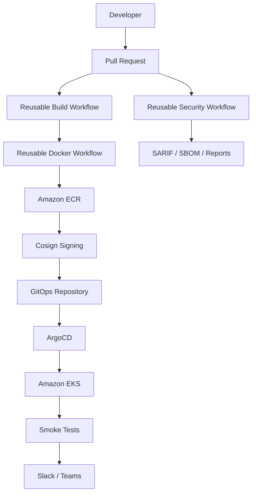

# github-actions-tpl

Enterprise-grade GitHub Actions template repository for reusable CI/CD, security, release, and GitOps delivery patterns.

This repository is designed to be copied or bootstrapped into new application repos and extended by platform teams.

## Architecture



## Repository Layout

```text
.github/workflows/
actions/
scripts/
docs/
examples/
docker/
argocd/
helm/
kubernetes/
```

## Pipeline Flow

### Java Pull Request

Checkout -> Setup Java -> Cache -> Compile -> Unit Tests -> JaCoCo -> SonarQube -> Quality Gate -> Checkmarx -> Dependency Check -> Secret Scan -> Docker Build -> Trivy -> SBOM -> SARIF

### Java Main

Checkout -> Versioning -> Docker Build -> AWS OIDC Login -> Push to ECR -> Cosign Sign -> Update GitOps -> Commit Tag -> Push GitOps -> ArgoCD Sync -> Smoke Test -> Slack Notify

### React Pull Request

Checkout -> Node Cache -> npm ci -> ESLint -> Unit Tests -> Coverage -> SonarQube -> Checkmarx -> npm audit -> Secret Scan -> Build

### React Main

Checkout -> Build -> Upload to S3 -> CloudFront Invalidation -> Security Header Validation -> ZAP Baseline -> Slack Notify

## Key Standards

- Use GitHub OIDC only for AWS access.
- Never store or use long-lived AWS access keys.
- Use placeholders for all tenant, account, and environment specific values.
- Fail builds on quality gate failure, critical vulnerabilities, and secret leaks.
- Favor reusable workflows and composite actions over copied workflow logic.

## GitHub Environments

Create these environments in each consuming repository:

- `development`
- `qa`
- `uat`
- `production`

Each environment should use required reviewers and any deployment protections your org mandates.

## Variables

Recommended repository or environment variables:

- `AWS_ACCOUNT_ID`
- `AWS_REGION`
- `AWS_ROLE_ARN`
- `ECR_REPOSITORY`
- `ECR_IMAGE_URI`
- `GITOPS_REPOSITORY`
- `GITOPS_BRANCH`
- `GITOPS_MANIFEST_PATH`
- `K8S_NAMESPACE`
- `EKS_CLUSTER_NAME`
- `S3_BUCKET`
- `CLOUDFRONT_DISTRIBUTION_ID`
- `REACT_SITE_URL`
- `HELM_RELEASE_NAME`
- `HELM_CHART_PATH`
- `SMOKE_TEST_URL`
- `ARGOCD_SERVER`
- `ARGOCD_APP_NAME`
- `SONAR_HOST_URL`
- `SONAR_PROJECT_KEY`
- `CHECKMARX_TENANT`
- `CHECKMARX_BASE_URI`
- `SLACK_CHANNEL`
- `TEAMS_WEBHOOK_URL`

## Secrets

Store these as GitHub secrets where applicable:

- `SONAR_TOKEN`
- `CHECKMARX_CLIENT_ID`
- `CHECKMARX_CLIENT_SECRET`
- `SLACK_WEBHOOK_URL`
- `TEAMS_WEBHOOK_URL`
- `ARGOCD_AUTH_TOKEN`
- `GITOPS_DEPLOY_KEY`

## OIDC Setup

1. Create an IAM role trusted by `token.actions.githubusercontent.com`.
2. Scope trust to the correct GitHub organization, repository, and branch/environment claim set.
3. Grant the role only the permissions needed for ECR, EKS, and related deployment operations.
4. Reference the role in workflows through `aws-actions/configure-aws-credentials`.

## AWS Setup

- Enable ECR repositories per application or per platform domain.
- Create EKS namespaces and cluster roles for each environment.
- Ensure CloudFront, S3, and Route53 permissions are limited to the React delivery path if used.
- Use KMS where applicable for encrypted artifacts, secrets, and state.

## SonarQube Setup

- Provision a project key per application.
- Configure branch and pull request analysis.
- Require the quality gate in protected branches.
- Store the token in GitHub secrets and the server URL in variables.

## Checkmarx Setup

- Create a tenant and application profile.
- Configure the scan policy to fail on critical issues.
- Map repository and branch names to application identifiers consistently.
- Store client credentials in GitHub secrets.

## ArgoCD Setup

- Create an ArgoCD project per platform domain or application family.
- Restrict destination clusters and namespaces.
- Use GitOps repository updates as the source of truth for environment promotion.
- Trigger syncs only after manifest updates have been committed.

## Onboarding a New Application

1. Copy the reusable workflow references into the application repository.
2. Set repository variables and secrets with placeholder-driven values.
3. Create the corresponding GitHub environments.
4. Wire in the correct build language and deployment path.
5. Connect the application to the GitOps repository and ArgoCD project.
6. Enable branch protections and required reviews before promotion to production.

## Placeholders

Use placeholders in docs, examples, and templates. Replace them only in the consuming repository or deployment environment.

- `<AWS_ACCOUNT_ID>`
- `<AWS_REGION>`
- `<AWS_ROLE_ARN>`
- `<ECR_REPOSITORY>`
- `<GITHUB_ORG>`
- `<GITOPS_REPOSITORY>`
- `<SONAR_URL>`
- `<SONAR_TOKEN>`
- `<CHECKMARX_TENANT>`
- `<CHECKMARX_BASE_URI>`
- `<K8S_NAMESPACE>`
- `<ARGOCD_SERVER>`
- `<ARGOCD_TOKEN>`
- `<SLACK_WEBHOOK>`
